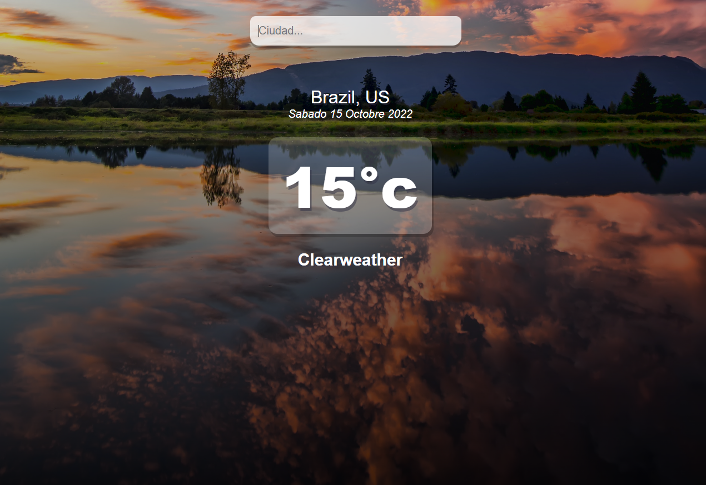

# Aplicacion con React(app clima).

cree una APP que utiliza la API de [OMDB](http://www.omdbapi.com/).utilizando __REACT__ y __REDUX__.
funcionalidades de la app:
* Busca el clima en tiempo real del pais que deseemos.
* Ademas los datos del dia mes y año

Tecnologías usadas: 
- Css.
- JavasCript.
- React.